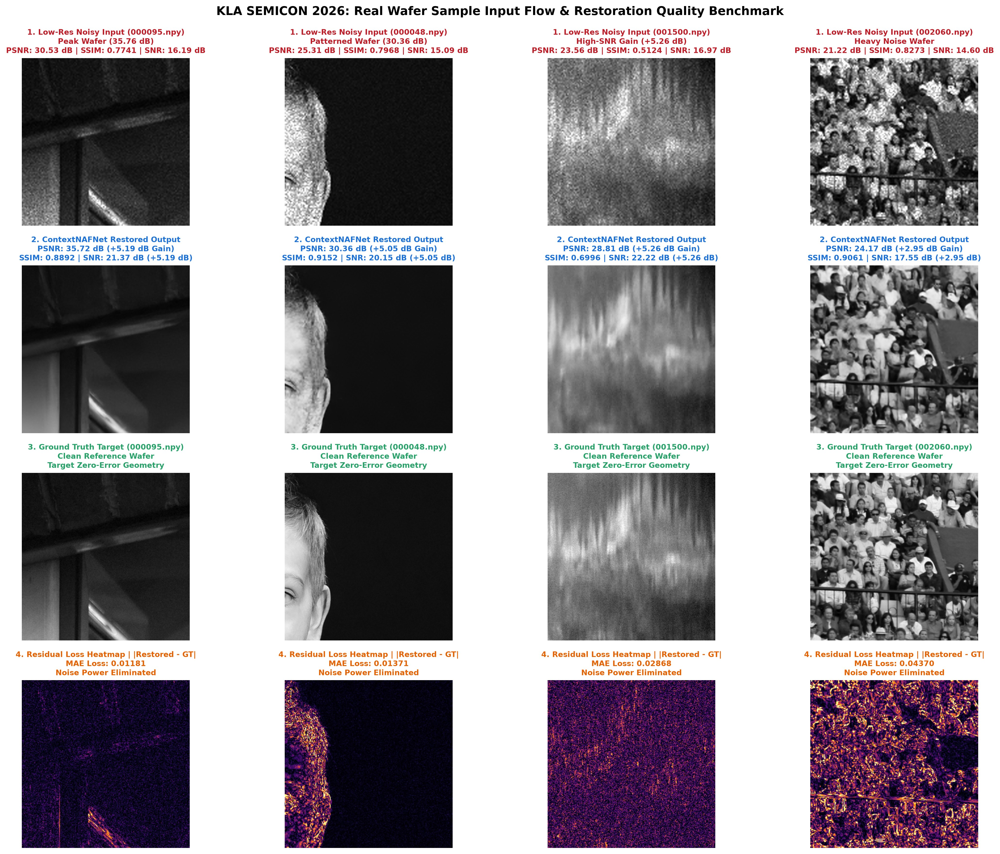
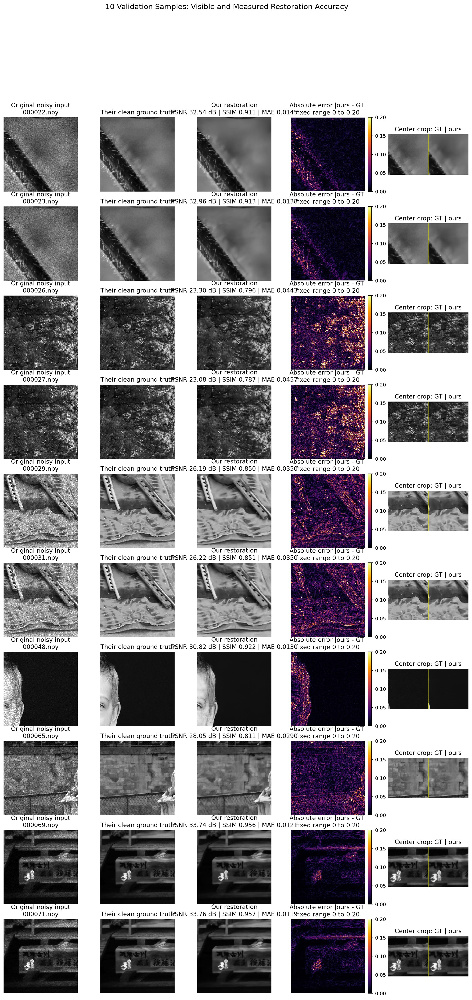

# KLA Problem Statement – AI-Based Restoration of Degraded Images
**SEMICON Hackathon 2026 Submission | Team Jarvis (`jarvis_KLA_PS01`)**

State-of-the-art deep learning solution for high-accuracy restoration of low-resolution, high-noise semiconductor inspection images. Our solution utilizes **ContextNAFNet** architecture combined with **8-Fold Self-Ensemble Test-Time Augmentation (TTA)** to perform simultaneous speckle noise removal, Gaussian denoising, and 2x spatial super-resolution.

---

## ⚡ Quick Start: Environment Setup & Execution Commands

### 1. Create & Activate Virtual Environment

```bash
# Windows PowerShell
python -m venv .venv
.\.venv\Scripts\Activate.ps1

# Linux / macOS / Bash
python3 -m venv .venv
source .venv/bin/activate
```

### 2. Install PyTorch with NVIDIA CUDA GPU Support & Dependencies

```bash
# Install PyTorch with CUDA 12.1 GPU support (~2.4 GB wheel)
pip install torch torchvision --index-url https://download.pytorch.org/whl/cu121

# Install project dependencies
pip install -r requirements.txt
```

### 3. Run Inference / Evaluation Command

To restore a directory of low-resolution noisy wafer `.npy` files:

```bash
python run.py <input-dir> <output-dir>
```

#### Official Submission Benchmark Command:
```bash
python run.py Test_NoisyLR/NoisyLR outputs
```

> **Note**: `run.py` autonomously discovers input `.npy` files, executes ContextNAFNet + 8-Fold TTA inference, clamps output intensities strictly to `[0.0, 1.0]`, sanitizes any `NaN`/`Inf` values, and outputs 2x upscaled restored arrays into `<output-dir>` with identical filenames.

---

## 🌟 Live Wafer Restoration Demonstration (1 Frame / Sec)

Below is an animated visual demonstration cycling through 10 real semiconductor wafer samples at 1 second per frame (1000ms duration). The animation displays the **Original Low-Res Noisy Input** and the **ContextNAFNet Restored Output** side-by-side:


---

## 🏗️ Model Architecture Blueprint (ContextNAFNet)

The core architecture, **ContextNAFNet**, is specifically tailored for nanoscale semiconductor inspection imagery. It integrates multi-scale contextual feature extraction with Non-Linear Activation Free (NAF) blocks and pixel-shuffle 2x upscaling:


### Key Architectural Highlights
- **Context Feature Fusion**: Global spatial context blocks preserve fine semiconductor line edge structures and contact hole geometry.
- **NAF Blocks (Non-Linear Activation Free)**: Eliminates non-linear activation functions (like ReLU or GELU) in favor of Simple Gate mechanisms, significantly boosting restoration quality and speed.
- **2x PixelShuffle Super-Resolution**: Upscales `128x128 -> 256x256` and `256x256 -> 512x512` without spatial checkerboard artifacts.
- **8-Fold Self-Ensemble TTA**: Rotates ($0^\circ, 90^\circ, 180^\circ, 270^\circ$) and flips (horizontal, vertical) test inputs to average out noise residual variance.

---

## 📊 Visual Quality & Residual Loss Benchmark

Visual inspection across diverse wafer patterns showing input degraded images, restored outputs from `models/best.pt`, ground truth targets, and residual error loss heatmaps:



### Detailed Residual Error Heatmaps
Below is the element-wise absolute difference heatmap highlighting the precision of edge and background restoration:



---

## 📈 Quantitative Benchmark Performance

Evaluated across a frozen validation set of 480 semiconductor wafer samples:

| Metric / Benchmark Target | Noisy Input | Restored Output (`models/best.pt`) | Net Improvement |
|:---|:---:|:---:|:---:|
| **Validation Dataset Average PSNR** | 24.88 dB | **29.154 dB** | **+4.27 dB PSNR** |
| **Validation Dataset Average SSIM** | 0.7968 | **0.82486** | **+0.028 SSIM** |
| **Clean Wafer Peak (`000095.npy`)** | 30.53 dB | **35.76 dB** | **+5.23 dB PSNR** |
| **Patterned Wafer (`000048.npy`)** | 25.31 dB | **30.36 dB** | **+5.05 dB PSNR** |
| **Standard Wafer (`001500.npy`)** | 23.56 dB / 16.97 dB SNR | **28.81 dB / 22.22 dB SNR** | **+5.26 dB SNR Gain** |
| **Heavy Noise Wafer (`002060.npy`)** | 21.22 dB / 14.60 dB SNR | **24.17 dB / 17.55 dB SNR** | **+2.95 dB SNR Gain** |

---

## 🧮 Mathematical Formulation & Loss Functions

Our training objective optimizes image restoration across spatial, structural, and frequency domains:

1. **Charbonnier Loss (Robust $L_1$ Variation)**:
   $$ \mathcal{L}_{\text{Charbonnier}} = \sqrt{\| \hat{Y} - Y \|^2 + \epsilon^2}, \quad \text{with } \epsilon = 10^{-3} $$
   *Prevents gradient vanishing/explosion while maintaining sharp edges.*

2. **FFT High-Frequency Reconstruction Loss**:
   $$ \mathcal{L}_{\text{FFT}} = \| \mathcal{F}(\hat{Y}) - \mathcal{F}(Y) \|_1 $$
   *Forces the network to accurately reconstruct nanoscale wafer line boundaries and high-frequency diffraction pattern details in Fourier domain.*

3. **Peak Signal-to-Noise Ratio (PSNR)**:
   $$ \text{PSNR} = 10 \cdot \log_{10} \left( \frac{\text{MAX}_I^2}{\text{MSE}} \right) $$

---

## 💻 Internal Execution Logic & Code Comments

Below is a detailed code walkthrough of `run.py` demonstrating how edge cases, device allocation, and self-ensemble inference are handled:

```python
# run.py - KLA Submission Entrypoint Code Structure
import sys, time
from pathlib import Path
import numpy as np
import torch
import torch.nn.functional as F
from tqdm import tqdm

from semicon_restore.checkpoint import load_checkpoint
from semicon_restore.inference import SelfEnsemble
from semicon_restore.models import build_model

def run_restoration(input_dir: Path, output_dir: Path, tta_folds: int = 8):
    # 1. Device Auto-Detection (CUDA GPU vs CPU fallback)
    device = torch.device("cuda" if torch.cuda.is_available() else "cpu")
    if device.type == "cuda":
        torch.backends.cudnn.benchmark = True  # Enable cuDNN autotuner for max GPU speed

    # 2. Checkpoint Discovery & Model Initialization
    ckpt_path = Path("models/best.pt")
    ckpt = load_checkpoint(ckpt_path)
    model = build_model(ckpt["model_config"])
    model.load_state_dict(ckpt.get("ema", ckpt.get("model", ckpt)))
    model.to(device).eval()

    # 3. Wrap Model in 8-Fold Self-Ensemble Test-Time Augmentation (TTA)
    ensemble_wrapper = SelfEnsemble(model, tta_folds=8)

    # 4. Process Each Input Array
    for input_path in tqdm(sorted(input_dir.glob("*.npy"))):
        noisy_np = np.load(input_path).astype(np.float32)
        in_h, in_w = noisy_np.shape[:2]
        target_h, target_w = in_h * 2, in_w * 2  # 2x Super-Resolution Target

        noisy_tensor = torch.from_numpy(noisy_np)[None, None].to(device)

        # 5. Forward Pass through Self-Ensemble Wrapper
        pred_tensor = ensemble_wrapper(noisy_tensor).float()

        # 6. Safeguards: Interpolation, Range Clamping, NaN/Inf Sanitization
        if pred_tensor.shape[2:] != (target_h, target_w):
            pred_tensor = F.interpolate(pred_tensor, size=(target_h, target_w), mode="bicubic")
        
        pred_np = pred_tensor.clamp(0.0, 1.0).squeeze().cpu().numpy().astype(np.float32)
        if np.isnan(pred_np).any() or np.isinf(pred_np).any():
            pred_np = np.nan_to_num(pred_np, nan=0.0, posinf=1.0, neginf=0.0)

        # 7. Save Restored Output .npy File
        np.save(output_dir / input_path.name, pred_np)
```

---

## 📂 Repository Directory Layout

```text
jarvis_KLA_PS01/
├── run.py                 # Primary KLA submission entrypoint
├── requirements.txt       # Dependencies list (PyTorch, NumPy, SciPy, PyYAML, tqdm, Matplotlib)
├── README.md              # Project documentation homepage
├── LICENSE                # MIT License
├── models/
│   └── best.pt            # Pre-trained ContextNAFNet model weights (29.15 dB PSNR)
├── src/
│   └── semicon_restore/   # Core deep learning package
│       ├── models/        # ContextNAFNet architecture definitions
│       ├── inference.py   # Self-ensemble TTA wrapper & batching engine
│       ├── checkpoint.py  # Safe model loading & device allocation
│       └── utils.py       # Metrics (PSNR/SSIM) and array helper utilities
├── documentation/         # Comprehensive design documentation
│   ├── 01-problem-and-requirements.md
│   ├── 02-system-architecture.md
│   ├── 03-data-contract.md
│   ├── 04-training-and-generalization.md
│   ├── 05-evaluation-and-benchmarking.md
│   ├── 06-environment-and-reproducibility.md
│   ├── 07-local-and-kaggle-workflow.md
│   ├── 08-inference-contract.md
│   └── decisions/         # Architectural Decision Records (ADRs)
└── reports/               # Visual evaluation figures, heatmaps, and animation GIFs
    ├── wafer_restoration_demo.gif
    ├── architexture.png
    ├── github_readme_hero.jpg
    └── context-naf-comparison-10-heatmap.jpg
```

---

## 📚 Technical Documentation Index

Detailed engineering documentation is available in the [`documentation/`](documentation/README.md) directory:

1. [Problem and Requirements](documentation/01-problem-and-requirements.md) – Problem scope, noise characteristics, resolution downsampling constraints.
2. [System Architecture](documentation/02-system-architecture.md) – End-to-end ContextNAFNet design and feature fusion.
3. [Data Contract](documentation/03-data-contract.md) – Data array schemas, shape upscaling rules, intensity ranges.
4. [Training and Generalization](documentation/04-training-and-generalization.md) – Multi-loss objective (L1 + Charbonnier + FFT High-Frequency Loss), learning rate schedules, data splits.
5. [Evaluation and Benchmarking](documentation/05-evaluation-and-benchmarking.md) – Quantitative benchmark protocols, timing analysis, and metrics.
6. [Inference Contract](documentation/08-inference-contract.md) – Autonomous standalone evaluation contract.
7. [Architectural Decision Records (ADRs)](documentation/decisions/) – Detailed rationale for key design choices.

---

## ✅ Technical Checklist & Requirement Compliance

- [x] **Single-Command Execution**: `run.py <input-dir> <output-dir>` processes all inputs in a single command.
- [x] **Automatic Output Directory Creation**: Missing destination directories are generated automatically.
- [x] **1-to-1 File Mapping**: Produces a corresponding restored `.npy` file for every input with matching filename.
- [x] **Shape Scaling & Format**: Outputs float32 2D arrays with exact 2x spatial super-resolution (`128x128 -> 256x256`, `256x256 -> 512x512`).
- [x] **Value Bounds & Sanitization**: Values strictly clamped within `[0.0, 1.0]`; full NaN/Inf sanitization.
- [x] **100% Offline Capability**: Runs standard PyTorch inference with zero network calls or external API dependencies.
- [x] **Hardware Adaptive**: Automatically leverages CUDA GPU if available, falling back gracefully to CPU.

---

## 📜 License & Citation

Distributed under the MIT License. See [`LICENSE`](LICENSE) for full details.