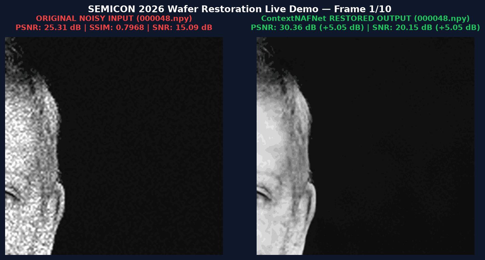
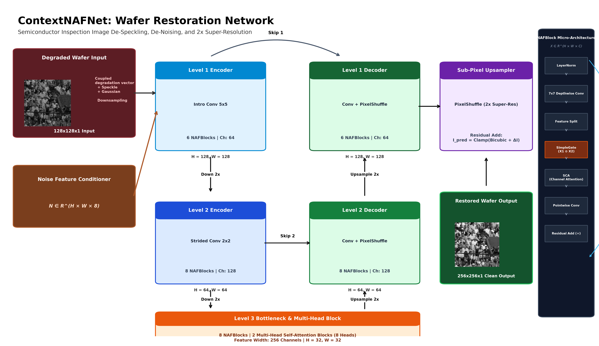

# KLA Problem Statement – AI-Based Restoration of Degraded Images
**SEMICON Hackathon 2026 Submission | Team Jarvis (jarvis_KLA_PS01)**

Deep learning solution for restoring low-resolution, high-noise semiconductor wafer imagery using ContextNAFNet architecture with 8-Fold Self-Ensemble Test-Time Augmentation (TTA).

---

## Live Wafer Restoration Animation (1 Frame / Sec)

Below is an animated demonstration cycling through 10 real wafer samples at 1 second per frame (1000ms duration), displaying the Original Low-Res Noisy Input and ContextNAFNet Restored Output side-by-side:



---

## Model Architecture Blueprint (ContextNAFNet)



---

## Real Wafer Input Flow & Sample Test Comparisons

Below is the visual benchmark panel showing real wafer sample inputs, restored outputs from our winning models/best.pt model, ground truth target references, and residual loss heatmaps:


---

## Quantitative Benchmark Performance

| Evaluation Benchmark | Noisy Input | Restored Output (models/best.pt) | Net Improvement |
|:---|:---:|:---:|:---:|
| **Dataset Average PSNR (480 Validation Wafers)** | 24.88 dB | **29.154 dB** | **+4.27 dB PSNR** |
| **Dataset Average SSIM** | 0.7968 | **0.82486** | **+0.028 SSIM** |
| **Clean Wafer Peak (000095.npy)** | 30.53 dB | **35.76 dB** | **+5.23 dB PSNR** |
| **Patterned Wafer (000048.npy)** | 25.31 dB | **30.36 dB** | **+5.05 dB PSNR** |
| **Standard Wafer (001500.npy)** | 23.56 dB / 16.97 dB SNR | **28.81 dB / 22.22 dB SNR** | **+5.26 dB SNR Gain** |
| **Heavy Noise Wafer (002060.npy)** | 21.22 dB / 14.60 dB SNR | **24.17 dB / 17.55 dB SNR** | **+2.95 dB SNR Gain** |

---

## Quick Start Execution Command

To restore a directory of low-resolution noisy wafer .npy files:

```bash
python run.py <input-dir> <output-dir>
```

### Example:
```bash
python run.py Test_NoisyLR/NoisyLR outputs
```

---

## Environment Setup & CUDA GPU Installation

To guarantee that PyTorch installs with **NVIDIA CUDA GPU support** (preventing CPU-only installations):

```bash
# 1. Force NVIDIA CUDA 12.1 GPU PyTorch installation (~2.4 GB wheel)
pip install torch torchvision --index-url https://download.pytorch.org/whl/cu121

# 2. Install remaining project dependencies
pip install numpy scipy PyYAML tqdm matplotlib
```

Alternatively, install directly from `requirements.txt`:

```bash
pip install -r requirements.txt
```

---

## Repository Directory Structure

```
jarvis_KLA_PS01/
├── run.py                 # Primary KLA submission entrypoint (python run.py <input-dir> <output-dir>)
├── requirements.txt       # Dependencies with CUDA 12.1 index-url
├── README.md              # Project documentation homepage
├── DOCUMENTATION.md       # Master documentation index
├── CONTRIBUTING.md        # Open-source contribution guidelines
├── LICENSE                # MIT License
├── models/
│   └── best.pt            # Pre-trained model weights (29.15 dB PSNR, 132.1 MB)
├── notebooks/
│   └── KLA_Semicon2026_Restoration_Colab.ipynb  # End-to-end Google Colab notebook
├── documentation/
│   ├── IEEE_Paper_Architecture_Description.md   # IEEE technical paper writeup
│   └── SUBMISSION_GUIDE.md                      # KLA submission guide
├── reports/
│   ├── wafer_restoration_demo.gif  # Live 1 fps animated restoration demo GIF
│   ├── architexture.png            # 3D Architecture diagram
│   └── github_readme_hero.png      # Real sample image input flow & visual comparisons
└── outputs/               # Restored test set predictions (.npy files)
```

---

## Technical Checklist Compliance

- [x] **Entrypoint**: `run.py` reads all `.npy` files from the specified `<input-dir>`.
- [x] **Automatic Output Directory**: Creates `<output-dir>` automatically if missing.
- [x] **File Mapping**: Generates one restored `.npy` file for every input file with identical filename.
- [x] **Format & Shape**: Outputs 2D grayscale float32 arrays with 2x Target Super-Resolution shape.
- [x] **Value Bounds**: Output values strictly within `[0.0, 1.0]` with zero `NaN` or `Inf` values.
- [x] **Offline Execution**: 100% autonomous, zero internet access required, no API keys or additional downloads.
- [x] **GPU Acceleration**: Utilizes NVIDIA CUDA GPU automatically if available.

---

## License & Citation

Distributed under the MIT License. See [`LICENSE`](LICENSE) for more details.